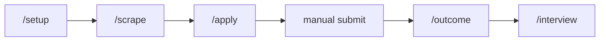

# GetJobIQ

<p align="center">
  <a href="https://sp-tc.com" target="_blank"> </a>
  <br/>
  Built by <a href="https://github.com/Mahmoud-Qandeel">Mahmoud Qandeel</a> · <a href="https://sp-tc.com" target="_blank">Space Technology Solutions</a>
</p>


**[English](README.md)** | [العربية](README.ar.md)

Evaluate job postings against your profile, draft a tailored CV and cover letter, track every application, and prep for interviews—all as slash commands that operate on plain files in your project.

**This version is project-scoped:** you copy the entire folder structure into your project, and paths are fixed relative to that root. A portable, agent-wide skill mode is planned for later.

## Verified in Practice

This workflow has been tested end-to-end on a real application: **Senior iOS Developer (Esti team)** at **Prequel**, submitted 2026-08-23, currently awaiting response. The test exercised:
- Draft detection (Step 0.5): fresh application, no conflicts
- The .tex-review pause (Step 4.5): workflow paused and waited for confirmation before compiling
- The closing message: rendered correctly with no auto-submit, directed to `/outcome` for status updates
- **Factual Grounding audit:** the CV and cover letter correctly acknowledged gaps rather than fabricating skills — even though the posting required StoreKit 2 and Structured Concurrency experience, those claims were omitted from the drafts (the candidate's real profile supports SwiftUI only), with those gaps noted in the cover letter instead

This is not a marketing claim or a success story — it's a verification that the workflow works as designed on real input, without inventing facts.

## Why GetJobIQ

This framework prioritizes three principles:

**Human stays in the loop.** There are no automated submissions. `/apply` stops and asks for explicit confirmation when a posting's location requirement conflicts with your declared constraints — ensuring logistics aren't silently overridden by an otherwise-strong fit score. Before compiling the PDF, the workflow pauses for your review of the LaTeX source. The closing message points you to the employer's portal for manual submission, then `/outcome` to update your tracker.

**Factual Grounding, not fabrication.** The drafting process only uses what's actually in your candidate profile. If a posting requires a skill you don't have, the CV acknowledges the gap and frames adjacent experience instead. The reviewer agent flags any claim that doesn't match your documented background, and the process refuses to proceed until it's grounded. Your track record stays honest.

**Built for real use, not automation theater.** The workflow is designed around the actual decision-making and manual steps you do anyway — fetching the full posting, reviewing before submitting, following up with employers. Each step adds value without pretending the computer can do your judgment for you.



## What it does

| Command | Purpose |
|---|---|
| `/setup` | Build your candidate profile from your documents or a guided interview |
| `/scrape` | Search job portals and company career pages for matching roles |
| `/rank` | Score and rank discovered postings against your fit framework |
| `/apply <posting>` | Evaluate the fit, draft a tailored CV + cover letter, and record the application |
| `/interview <company>` | Build a stage-specific interview prep pack from this application's archive |
| `/outcome <company>` | Record an interview result or final decision and update your tracker |
| `/add-portal` | Register a new job portal for `/scrape` to search |
| `/add-template` | Register a custom CV or cover letter template (LaTeX, Typst, or other) |
| `/expand` | Discover competencies hidden in your documents and online presence |
| `/reset` | Clear parts of your profile to start fresh with `/setup` |
| `/gmail-sync` | Scan Gmail for status signals on your applications and sync them to the tracker |
| `/notion-sync` | Publish your job search to a Notion database (read-only, synced from local files) |
| `/html-report` | Generate a self-contained dashboard from your tracker and application archive |
| `/upskill` | Analyze your tracked jobs to identify skill gaps and generate a learning plan |

**Multi-language by design:** Candidate profiles and search queries support multiple languages natively. Your profile's Languages table declares every language you work in; `/scrape` automatically generates search queries in each declared language, and the framework's evaluation gates handle bilingual postings correctly without translation steps.

## Key Workflow Behaviors

- **No automatic submission:** `/apply` drafts and archives your CV and cover letter, records them in the tracker as `drafted`, and displays the job posting URL — but does not submit the application. You submit manually via the employer's portal, then run `/outcome` to update the tracker to `applied`.

- **Location conflict checkpoint:** When `/apply` Step 1 detects that a posting's location requirement conflicts with your declared constraint (e.g., on-site in a location you've marked as too far, or vice versa), the workflow stops and asks for explicit confirmation before drafting. This ensures location logistics aren't silently overridden by an otherwise-strong fit score.

- **Eligibility flags in /scrape results:** Remote postings from US/EU-based sources where work-authorization or sponsorship eligibility wasn't confirmed in the summary are flagged as "Remote ⚠ (verify eligibility)" in the results table and in highlights. This signals that eligibility must be verified in the full posting during `/apply` Step 0 before investing time.

- **Draft detection:** Re-running `/apply` on a company/role that already has a draft on disk doesn't silently overwrite it. The workflow detects the existing files and asks whether to re-draft from scratch, resume from the existing draft (skip straight to compile), or cancel.

## Installation

1. **Copy these folders to your project root**, preserving the layout:
   - `01-FRAMEWORK/` — all skills and commands
   - `02-Documents/` — your CV, LinkedIn export, reference letters, and application archive
   - `03-JOB-SEARCH/` — search strategy queries (the copy under `01-FRAMEWORK/.claude/skills/job-scraper/` is the one commands actually use; this folder holds an additional reference copy)
   - `04-APPLICATIONS/` — your CV templates, cover letter templates, and tailored application drafts

2. **Open your project in Claude Code** (or another AI agent that supports `.claude/` skills and commands).

3. **Run `/setup`** to build your candidate profile:
   - Drop your CV, LinkedIn export, diplomas, and reference letters into `02-Documents/`
   - Or paste a single CV if you don't have documents
   - Or answer the guided interview questions

   `/setup` populates all the profile files automatically—nothing needs to be hand-edited first.

   Tip: install Bun before your first `/scrape` for best results; see the Requirements callout above for why the portal CLIs are noticeably stronger than WebSearch fallback.

4. **Paste a job posting and run `/apply`** to see the workflow end to end.

## File and folder structure

```
01-FRAMEWORK/
├── CLAUDE.md                     # Your candidate profile (identity, education, experience, skills)
├── README.md                     # Framework documentation
├── SETUP.md, SECURITY.md, etc.  # Reference guides
├── .claude/
│   ├── skills/
│   │   ├── job-application-assistant/  # Evaluation framework, CV/letter rules, interview prep
│   │   │   ├── 01-candidate-profile.md
│   │   │   ├── 02-behavioral-profile.md
│   │   │   ├── 03-writing-style.md
│   │   │   ├── 04-job-evaluation.md
│   │   │   ├── 05-cv-templates.md       # Stock LaTeX CV structure
│   │   │   ├── 06-cover-letter-templates.md  # Stock LaTeX cover letter
│   │   │   ├── 07-interview-prep.md
│   │   │   ├── 08-application-forms.md
│   │   │   └── 09-web-research.md
│   │   ├── job-scraper/                # Portal orchestration and search strategy
│   │   │   └── search-queries.md       # Your role titles, skills, and location filters
│   │   └── upskill/                    # Learning plan generation
│   └── commands/                       # Slash commands (/apply, /scrape, /rank, etc.)
└── .agents/skills/                     # Portal-search CLIs (LinkedIn, Jobindex, Jobbank, etc.)

02-Documents/
├── cv/                          # Your master CV (PDF or LaTeX)
├── linkedin/                    # LinkedIn profile export (PDF)
├── diplomas/                    # Degree certificates and transcripts
├── references/                  # Reference letters
├── postings/                    # Pasted job posting text when Claude can't fetch
└── applications/                # Per-application archive (created by /apply and /outcome)
    └── <company>/<role>/
        ├── job_posting.md       # The posting you applied for
        ├── outcome.md           # Interview progress and result
        ├── CV/
        │   ├── <company>_<role>_<name>_CV.<cv-ext>       # The CV variant you submitted
        │   └── <company>_<role>_<name>_CV.pdf            # Compiled PDF
        └── cover_letter/
            ├── <company>_<role>_<name>_cover.<cover-ext> # The cover letter you submitted
            └── <company>_<role>_<name>_cover.pdf         # Compiled PDF

03-JOB-SEARCH/
└── search-queries.md            # Reference copy of search strategy

04-APPLICATIONS/
├── cv/
│   └── main_example.tex         # Stock CV template (LaTeX) — your master baseline; tailored drafts live under 02-Documents/applications/
├── cover_letters/
│   ├── cover.cls                # Stock LaTeX class
│   └── cover_example.tex        # Stock cover letter template
└── templates/
    ├── cv/
    │   └── <name>/
    │       ├── TEMPLATE.md      # Custom template manifest (created by /add-template)
    │       └── template<ext>    # Custom CV skeleton
    └── cover_letters/
        └── <name>/
            ├── TEMPLATE.md      # Custom template manifest
            └── template<ext>    # Custom cover letter skeleton

job_search_tracker.csv           # Application tracker (created by /apply and /outcome)
job_scraper/
├── seen_jobs.json               # Scraper dedup state and ranked jobs (created by /scrape and /rank)
└── notion_sync.json             # Notion database state (created by /notion-sync, gitignored)
```

## Requirements

- **Claude Code** or another AI agent with `.claude/` skill/command support
- **Bun** — for running portal-search CLIs (`bun run` must work on your system)
- **LaTeX** — `lualatex` (for compiling the default CV template) and `xelatex` (for the default cover letter template); required only if you use the stock LaTeX templates. Custom templates registered via `/add-template` can use Typst, Markdown, or another toolchain instead.
- **`pdftotext` (poppler)** — optional, used only in `/apply` Step 5d for ATS text-layer verification; gracefully skipped if not installed
- **Python** — optional, used only for the salary-lookup benchmark in `/apply` Step 1 (`python 01-FRAMEWORK/salary_lookup.py`); skipped if not configured

> ⚠️ **Install Bun for best `/scrape` results.** Without it, portal CLIs (LinkedIn, Jobindex, etc.) can't run, and `/scrape` falls back to WebSearch — which returns fewer results and misses listings the CLIs would have found. Install with:
> `curl -fsSL https://bun.sh/install | bash`

## Custom Templates

Register a custom CV or cover letter template with `/add-template`. It:

1. Stores your template skeleton and metadata in `04-APPLICATIONS/templates/cv/<name>/` or `04-APPLICATIONS/templates/cover_letters/<name>/`
2. Creates a manifest file (`TEMPLATE.md`) declaring the source extension, compile command, page limit, and style rules
3. Activates the template by inserting a managed block at the top of `05-cv-templates.md` or `06-cover-letter-templates.md`
4. `/apply` reads this managed block and uses the declared extension, compile command, and page limits for all subsequent applications

You can switch between custom templates or revert to the stock LaTeX templates with `/add-template --use <name>` or `/add-template --use default`.

## Privacy

Your candidate profile (`01-FRAMEWORK/CLAUDE.md`), skill profile files, tailored CVs and cover letters, application tracker (`job_search_tracker.csv`), scraper state (`job_scraper/`), and application archive (`02-Documents/applications/`) all contain personal data.

**If this project folder is in a public or shared repository, add these to your `.gitignore` before your first commit:**

```
01-FRAMEWORK/CLAUDE.md
01-FRAMEWORK/.claude/skills/job-application-assistant/01-candidate-profile.md
01-FRAMEWORK/.claude/skills/job-application-assistant/02-behavioral-profile.md
01-FRAMEWORK/.claude/skills/job-scraper/search-queries.md
02-Documents/
job_search_tracker.csv
job_scraper/
```

Or keep the repository private.

## License

MIT, see [LICENSE](LICENSE).

---

**Mahmoud Qandeel** — Founder & CEO at <a href="https://sp-tc.com" target="_blank">Space Technology Solutions</a>

GitHub: [@Mahmoud-Qandeel](https://github.com/Mahmoud-Qandeel)
